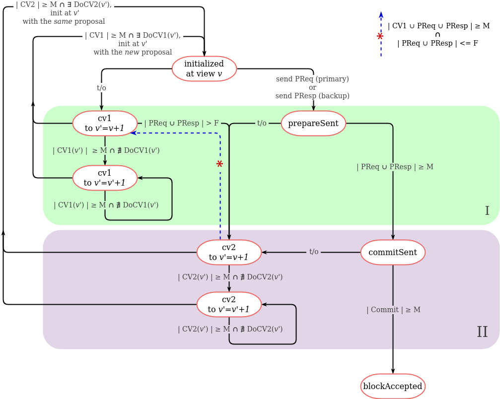

# dBFT formal models

This section contains a set of dBFT's formal specifications written in
[TLA⁺](https://lamport.azurewebsites.net/tla/tla.html) language. The models
describe the core algorithm logic represented in a high-level way and can be used
to illustrate some basic dBFT concepts and to validate the algorithm in terms of
liveness and fairness. It should be noted that presented models do not precisely
follow the dBFT implementation presented in the repository and may omit some
implementation details in favor of the specification simplicity and the
fundamental philosophy of the TLA⁺. However, the presented models directly
reflect some liveness problems dBFT 2.0 has; the models can and are aimed to be
used for the dBFT 2.0 liveness evaluation and further algorithm improvements.

Any contributions, questions and discussions on the presented models are highly
appreciated.

## dBFT 2.0 models

### Basic dBFT 2.0 model

This specification is a basis that was taken for the further algorithm
investigation. We recommend to begin acquaintance with the dBFT models from this
one.
 
The specification describes the process of a single block acceptance: the set of
resource managers `RM` (which is effectively a set of consensus nodes)
communicating via the shared consensus message pool `msgs` and taking the
decision in a few consensus rounds (views). Each consensus node has its own state
at each step of the behaviour. Consensus node may send a consensus message by
adding it to the `msgs` pool. To perform the transition between states the
consensus node must send a consensus message or there must be a particular set of
consensus messages in the shared message pool required for a particular
transition.

Here's the scheme of transitions between consensus node states:

The specification also describes two kinds of malicious nodes behaviour that can
be combined, i.e. enabled or disabled independently for each particular node:

1. "Dead" nodes. "Dead" node is completely excluded from the consensus process
   and not able to send the consensus messages and to perform state transitions.
   The node may become "dead" at any step in the middle of the consensus process.
   Once the node becomes "dead" there's no way for it to rejoin the consensus
   process.
2. "Faulty" nodes. "Faulty" node is allowed to send consensus messages of *any*
   type at *any* step and to change its view without regarding the dBFT view
   changing rules. The node may become "faulty" at any step in the middle of the
   consensus process. Once the node becomes "faulty" there's no way for it to
   become "good" again.

The specification contains several invariants and liveness properties that must
be checked by the TLC Model Checker. These formulas mostly describe two basic
concepts that dBFT algorithm expected to guarantee:

1. No fork must happen. There must be no situation such that two different
   blocks are accepted at two different consensus rounds (views).
2. The block must always be accepted. There must be no situation such that nodes
   are stuck in the middle of consensus process and can't take any further steps.

The specification is written and working under several assumptions:

1. All consensus messages are valid. In real life it is guaranteed by verifiable
   message signatures. In case if malicious or corrupted message is received it
   won't be handled by the node.
2. The exact timeouts (e.g. t/o on waiting a particular consensus message, etc.)
   are not included into the model. However, the model covers timeouts in
   general, i.e. the timeout is just the possibility to perform a particular
   state transition.
3. All consensus messages must eventually be delivered to all nodes, but the
   exact order of delivering isn't guaranteed.
4. The maximum number of consensus rounds (views) is restricted. This constraint
   was introduced to reduce the number of possible model states to be checked.
   The threshold may be specified via model configuration, and it is highly
   recommended to keep this setting less or equal to the number of consensus
   nodes.

Here you can find the specification file and the TLC Model Checker launch
configuration:

* [TLA⁺ specification](./dbft/dbft.tla)
* [TLC Model Checker configuration](./dbft/dbft___AllGoodModel.launch)

### Extended dBFT 2.0 model

This is an experimental dBFT 2.0 specification that extends the
[basic model](#basic-dbft-20-model) in the following way: besides the shared pool
of consensus messages `msgs` each consensus node has its own local pool of
received and handled messages. Decisions on transmission between the node states
are taken by the node based on the state of the local message pool. This approach
allows to create more accurate low-leveled model which is extremely close to the
dBFT implementation presented in this repository. At the same time such approach
*significantly* increases the number of considered model states which leads to
abnormally long TLC Model Checker runs. Thus, we do not recommend to use this
model in development and place it here as an example of alternative (and more
detailed) dBFT specification. These two models are expected to be equivalent in
terms of the liveness locks that can be discovered by both of them, and, speaking
the TLA⁺ language, the Extended dBFT specification implements the
[basic one](#basic-dbft-20-model) (which can be proven and written in TLA⁺, but
stays out of the task scope).

Except for this remark and a couple of minor differences all the
[basic model](#basic-dbft-20-model) description, constraints and assumptions are
valid for the Extended specification as far. Thus, we highly recommend to
consider the [basic model](#basic-dbft-20-model) before going to the Extended
one.
 
Here you can find the specification file and the TLC Model Checker launch
configuration:

* [TLA⁺ specification](./dbftMultipool/dbftMultipool.tla)
* [TLC Model Checker configuration](./dbftMultipool/dbftMultipool___AllGoodModel.launch)

## Proposed dBFT 2.1 models

Based on the liveness locks scenarios found by the TLC model checker in the
[basic dBFT 2.0 model](#basic-dbft-20-model) we've developed two extensions of
dBFT 2.0 protocol that allow to avoid the liveness lock problem and to preserve
the safety properties of the algorithm. The extensions currently don't have
any code-level implementation and presented as a TLA⁺ specifications ready to be
reviewed and discussed. The improved protocol presented in the extensions will
be referred below as dBFT 2.1.

We've checked both dBFT 2.1 models with the TLC Model Checker against the same
set of launch configurations that was used to reveal the liveness problems of the
[basic dBFT 2.0 model](#basic-dbft-20-model). The improved models have larger
set of states, thus, the TLC Model Checker wasn't able to finish the liveness
requirements checks for *all* possible states. However, the checks have passed for
a state graph diameter that was large enough to believe the presented models
solve the dBFT 2.0 liveness lock problems.

### Common `Commit` message improvement note

Here and below we assume that `Commit` messages should bear preparation hashes
from all nodes that have sent the preparation message (>= `M` but not including
a whole `PrepareRequest`). This quickly synchronizes nodes still at the preparation
stage when someone else collects enough preparations. It at the same time prevents
malicious/byzantine nodes from sending spoofed `Commit` messages. The `Commit`
message size becomes a little bigger, but since it's just hashes it still fits
into a single packet in the vast majority of the cases, so it doesn't really matter.

### dBFT 2.1 stages-based model

The basic idea of this model is to split the consensus process into three subsequent
stages marked as `I`, `II` and `III` at the scheme. To perform a transition between
two subsequent stages each consensus node should wait for a set of messages from
at least `M` consensus nodes to be received so that it's possible to complete a full
picture of the neighbours' decisions in the current consensus round. In other words,
no transition can happen unless we have `M` number of messages from the subsequent round,
timers are only set up after we have this number of messages, just to wait for
(potentially) a whole set of them. At the same time, each of the stages has
its own `ChangeView[1,2,3]` message to exit to the next consensus round (view) if
something goes wrong in the current one and there's definitely no ability to
continue consensus process in the current view. Below there's a short description
of each stage. Please, refer to the model scheme and specification for further
details.

#### Stage I

Once initialized, consensus node has two ways:
1. Send its `PrepareRequest`/`PrepareResponse` message (and transmit to the
  `prepareSent` state).
2. Decide to go to the next view on timeout or any other valid reason (like
  transaction missing in the node's mempool or wrong proposal) via sending
  `ChangeView1` message (and transmit to the `cv1` state).

This scheme is quite similar to the basic dBFT 2.0 model except the new type of
`ChangeView` message. After that the node enters stage `I` and waits for consensus
messages of stage `I` (`PrepareRequest` or `PrepareResponse` or `ChangeView1`)
from at least `M` neighbours which is needed to decide about the next actions.
The set of received messages can be arranged in the following way:

* `M` messages of `ChangeView1` type denote that `M` nodes have decided to change
  their view directly after initialization due to invalid/missing `PrepareRequest`
  which leads to immediate view changing. This is a "fail fast" route that is the
  same as with dBFT 2.0 for the widespread case of missing primary. No additional
  delay is added, everything works as usual.
* `M` preparation messages (of type `PrepareRequest` or `PrepareResponse`) with
  missing `ChangeView3` denote that the majority of nodes have decided to commit which
  denotes the safe transition to stage `II` can be performed and `Commit` message
  can safely be sent even if there's `ChangeView1` message in the network. Notice
  that `ChangeView3` check is just a protection against node seriously lagging
  behind.
* `M` messages each of the type `PrepareRequest` or `PrepareResponse` or `ChangeView1`
  where at least one message is of the type `ChangeView1` denote that at least `M`
  nodes have reached the stage `I` and the node can safely take further steps.
  The additional `| Commit | ≤ F ∪ | CV3 | > 0` condition requires the majority of
  nodes not to have the `Commit` message to be sent so that it's still possible to
  collect enough `ChangeView[2,3]` messages to change the view in further stages.
  If so, then the safe transition to stage `II` can be performed and `ChangeView2`
  message can safely be sent.

#### Stage II

Once the node has `Commit` or `ChangeView2` message sent, it enters the stage `II`
of the consensus process and waits for at least `M` messages of stage `II`
(`Commit` or `ChangeView2`) to perform the transition to the next stage. The set
of accepted messages can be arranged in the following way:

* `M` messages of `ChangeView2` type denote that `M` nodes have decided to change
  their view directly after entering the stage `II` due to timeout while waiting
  for the `Commit` messages which leads to immediate view changing.
* `M` messages of type `Commit` denote that the majority of nodes have decided to
  commit which denotes the block can be accepted immediately without entering the
  stage `III`. Notice that this is the regular flow of normal dBFT 2.0 consensus,
  it also hasn't been changed and proceeds the way it was before.
* `M` messages each of the type `Commit` or `ChangeView2` where not more than `F`
  messages are of the type `Commit` denotes that the majority of nodes decided to
  change their view after entering the stage `II` and there's not enough `Commit`
  messages to create the block (and produce the fork), thus, the safe transition
  to stage `III` can be performed and `ChangeView3` message can safely be sent
  even if there's `Commit` message in the network.

In addition, the direct transition from `cv2` state to the `commitSent` state is
added in case if it's clear that there's more than `F` nodes have decided to
commit and no `ChangeView3` message has been received which means that it's possible
to produce block in the current view. This path handles a corner case of missing
stage `I` messages, in fact, because `Commit` messages prove that there are at
least `M` preparation messages exist, but the node went `cv2` path just because
it missed some of them.

#### Stage III

Unlike the basic dBFT 2.0 model where consensus node locks on the commit phase,
stage `III` gives the ability to escape from the commit phase via collecting the set
of `M` `ChangeView3` messages. This phase is reachable as soon as at least `M` nodes
has reached the phase `II` (have `ChangeView2` or `Commit` messages sent) and if
there's not enough `Commit` messages (<=`F`) to accept the block. This stage is
added to avoid situation when the node is being locked on the `commitSent` state
whereas the rest of the nodes (>`F`) is willing to go to the next view.

Here's the scheme of transitions between consensus node states for the improved
dBFT 2.1 stages-based model:

Here you can find the specification file and the basic TLC Model Checker launch
configuration:

* [TLA⁺ specification](./dbft2.1_threeStagedCV/dbftCV3.tla)
* [TLC Model Checker configuration](./dbft2.1_threeStagedCV/dbftCV3___AllGoodModel.launch)

### dBFT 2.1 model with the centralized view changes

The improvement which was taken as a base for this model is taken from the pBFT
algorithm and is as follows.
The consensus process is split into two stages with the following meaning:

* Stage `I` holds the node states from which it's allowed to transmit to the subsequent
  view under assumption that the *new* proposal will be generated (as the basic dBFT 2.0
  model does).
* Stage `II` holds the node states from which it's allowed to perform view change
  *preserving* the proposal from the previous view.

Another vital difference from the basic dBFT 2.0 model is that view changes are
being performed by the node on the `DoCV[1,2]` command (consensus message) sent by the
leader of the target view specified via `DoCV[1,2]` parameters. Aside from the target view
parameter, `DoCV[1,2]` message contains the set of all related pre-received consensus messages
so that the receivers of `DoCV[1,2]` are able to check its validness before the subsequent
view change.

Below presented the short description of the proposed consensus process. Please, refer to the
model scheme and specification for further details.

#### Stage I

Once initialized at view `v`, the consensus node has two ways:

1. Send its `PrepareRequest`/`PrepareResponse` message (and transmit to the
  `prepareSent` state).
2. Decide to go to the next view `v+1` on timeout or any other valid reason like
  transaction missing in the node's mempool via sending `ChangeView1(v+1)` message
  (and transmitting to the `cv1 to v'=v+1` state).

After that the node enters stage `I` and perform as follows:

* If the node has its `PrepareRequest` or `PrepareResponse` sent:
    * If at least `M` preparation messages (including its own) collected, then
      it's clear that the majority has proposal for view `v` being accepted as
      valid and the node can safely send the `Commit` message and transmit to the
      phase `II` (`commitSent` state).
    * If there's not enough preparation payloads received from the neighbours for a
      long time, then the node is allowed to transmit to the stage `II` via sending
      its `ChangeView2` message (and changing its state to the `cv2 to v'=v+1`). It
      denotes the node's desire to change view to the next one with the current proposal
      to be preserved.
* If the node entered the `cv1 to v'=v+1` state:
    * If there's a majority (>=`M`) of `ChangeView1(v+1)` messages and the node is
      primary in the view `v+1` then it should send the signal (`DoCV1(v+1)` message)
      to the rest of the group to change their view to `v+1` with the new proposal
      generated. The rest of the group (backup on `v+1` view that have sent their
      `ChangeVeiew1(v+1)` messages) should change their view on `DoCV1(v+1)` receiving.
    * If there's a majority (>=`M`) of `ChangeView1(v+1)` messages collected, but
      `DoCV1(v+1)` is missing for a long time, then the node is able to "skip" view
      `v+1` and send the `ChangeView1(v+2)` message hoping that the primary of `v+2`
      will be faster enough to send the `DoCV1(v+2)` signal. The process can be repeated
      on timeout for view `v+3`, etc.
    * If there's more than `F` nodes that have sent their preparation messages
      (and, consequently, announced their desire to transmit to the stage `II` of the
      current view rather than to change view), then it's clear that it won't be more than `F` messages
      of type `ChangeView1` to perform transition to the next view from the stage `II`.
      Thus, the node is allowed to send its `ChangeView2` message (and change its
      state to the `cv2 to v'=v+1`). Such situation may happen if the node haven't
      proposal received in time (consider valid proposal).

#### Stage II

Once the node has entered the stage `II`, the proposal of the current round is
considered to be valid. Depending on the node's state the following decisions are
possible:

* If the node has its `Commit` sent and is in the `commitSent` state:
    * If the majority (>=`M`) of the `Commit` messages has been received, then the
      block may be safely accepted for the current proposal.
    * If there's not enough `Commit` messages for a long time, then it's legal to
      send the `ChangeView2(v+1)` message, transmit to the `cv2 to v'=v+1` state
      and decide to go to the next view `v+1` preserving the current proposal
      and hoping that it would be possible to collect enough `Commit` messages
      for it in the view `v+1`.
* If the node is in the `cv2 to v'=v+1` state then:
    * If there's a majority (>=`M`) of `ChangeView2(v+1)` messages and the node is
      primary in the view `v+1` then it should send the signal (`DoCV2(v+1)` message)
      to the rest of the group to change their view to `v+1` with the old proposal of view `v`
      preserved. The rest of the group (backup on `v+1` view that have sent their
      `ChangeVeiew2(v+1)` messages) should change their view on `DoCV2(v+1)` receiving.
    * If there's a majority (>=`M`) of `ChangeView2(v+1)` messages collected, but
      `DoCV2(v+1)` is missing for a long time, then the node is able to "skip" view
      `v+1` and send the `ChangeView2(v+2)` message hoping that the primary of `v+2`
      will be faster enough to send the `DoCV2(v+2)` signal. The process can be repeated
      on timeout for view `v+3`, etc.
    * Finally, if the node receives at least `M` messages from the stage `I` at max
      `F` of which are preparations (the blue dotted arrow from `cv2 to v'=v+1` to
      `cv1 to v'=v+1` state), it has the ability to go back to the `cv1` state to start
      the new consensus round with the new proposal. This case is kind of special,
      it allows to escape from the deadlock situation when the node is locked on `cv2`
      state unable to perform any further steps whereas the rest of the network are
      waiting in the `cv1` state. Consider the case of four-nodes network where the
      first node is permanently "dead", the primary have sent its `PrepareRequest`
      and went to the `cv2` state on the timeout and the rest two nodes are waiting
      in the `cv1` state not able to move further.
      
It should be noted that "preserving the proposal of view `v` in view `v+1`" means
that the primary of view `v+1` broadcasts the `PrepareRequest` message at view `v+1`
that contains the same set of block's fields (transactions, timestamp, primary, etc) as
the `PrepareRequest` proposed in the view `v` has.

Here's the scheme of transitions between consensus node states for the improved
dBFT 2.1 model with the centralized view changes process:

Here you can find the specification file and the basic TLC Model Checker launch
configuration:

* [TLA⁺ specification](./dbft2.1_centralizedCV/dbftCentralizedCV.tla)
* [TLC Model Checker configuration](./dbft2.1_centralizedCV/dbftCentralizedCV___AllGoodModel.launch)

## MEV-resistant dBFT models

[Neo X chain](https://docs.banelabs.org/) uses dBFT 2.0 algorithm as a consensus engine. As a part of
the Neo X anti-MEV feature implementation, dBFT 2.0 extension was designed to
provide single-block finality for encrypted transactions (a.k.a. envelope
transactions). Compared to dBFT 2.0, MEV-resistant dBFT algorithm includes an
additional `post-Commit` phase that is required to be passed through by consensus
nodes before every block acceptance. This phase allows consensus nodes to exchange
some additional data related to encrypted transactions and to the final state of
accepting block using a new type of consensus messages. The improved protocol based
on dBFT 2.0 with an additional phase will be referred below as MEV-resistant dBFT.

We've checked MEV-resistant dBFT model with the TLC Model Checker against the same
set of launch configurations that was used to reveal the liveness problems of the
[basic dBFT 2.0 model](#basic-dbft-20-model). MEV-resistant dBFT model brings no extra problems to the
protocol, but it has been proved that this model has exactly the same
[liveness bug](https://github.com/neo-project/neo-modules/issues/792) that the
original dBFT 2.0 model has which is expected.

### Basic MEV-resistant dBFT model

This specification is an extension of the
[basic dBFT 2.0 model](#basic-dbft-20-model). Compared to the base model,
MEV-resistant dBFT specification additionally includes:

1. New message type `CommitAck` aimed to reflect an additional protocol
   message that should be sent by resource manager if at least `M` `Commit`
   messages were collected by the node (that confirms a.k.a. "PreBlock"
   final acceptance).
2. New resource manager state `commitAckSent` aimed to reflect the additional phase
   of the protocol needed for consensus nodes to exchange some data that was not
   available at the time of the first commit. This RM state represents a consensus
   node state when it has sent these additional post-commit data but has not accepted
   the final block yet.
3. New specification step `RMSendCommitAck` describing the transition between
   `commitSent` and `commitAckSent` phases of the protocol, or, which is the same,
   corresponding resource managers states. This step allows the resource manager to
   send `CommitAck` message if at least `M` valid `Commit` messages are collected.
4. Adjusted behaviour of `RMAcceptBlock` step: block acceptance is possible iff the
   node has sent the `CommitAck` message and there are at least `M` `CommitAck`
   messages collected by the node.
5. Adjusted behaviour of "faulty" resource managers: allow malicious nodes to send an
   `CommitAck` message via `RMFaultySendCommitAck` step.

It should be noted that, in comparison with the dBFT 2.0 protocol where the node is
being locked in the `commitSent` state until the block acceptance, MEV-resistant dBFT
does not allow to accept the block right after the `commitSent` state. However, it
allows the node to move from `commitSent` phase further to the `commitAckSent` state
and locks the node at this state until the block acceptance. No view change may be
initiated or accepted by a node entered the `commitAckSent` state.

Here's the scheme of transitions between consensus node states for MEV-resistant dBFT
algorithm:

Here you can find the specification file and the basic MEV-resistant dBFT TLC Model
Checker launch configuration for the four "honest" consensus nodes scenario:

* [TLA⁺ specification](dbft_antiMEV/dbft.tla)
* [TLC Model Checker configuration](dbft_antiMEV/dbft___AllGoodModel.launch)

## How to run/check the TLA⁺ specification

### Prerequirements

1. Download and install the TLA⁺ Toolbox following the
   [official guide](http://lamport.azurewebsites.net/tla/toolbox.html).
2. Read the brief introduction to the TLA⁺ language and TLC Model Checker at the
   [official site](http://lamport.azurewebsites.net/tla/high-level-view.html).
3. Download and take a look at the
   [TLA⁺ cheat sheet](https://lamport.azurewebsites.net/tla/summary-standalone.pdf).
4. For a proficient learning watch the
   [TLA⁺ Video Course](https://lamport.azurewebsites.net/video/videos.html) and
   read the [Specifying Systems book](http://lamport.azurewebsites.net/tla/book.html?back-link=tools.html#documentation).

### Running the TLC model checker

1. Clone the [repository](https://github.com/nspcc-dev/dbft.git).
2. Open the TLA⁺ Toolbox, open new specification and provide path to the desired
   `*.tla` file that contains the specification description.
3. Create the model named `AllGoodModel` in the TLA⁺ Toolbox.
4. Copy the corresponding `*___AllGoodModel.launch` file to the `*.toolbox`
   folder. Reload/refresh the model in the TLA⁺ Toolbox.
5. Open the `Model Overview` window in the TLA⁺ Toolbox  and check that behaviour
   specification, declared constants, invariants and properties of the model are
   filled in with some values.
6. Press `Run TLC on the model` button to start the model checking process and
   explore the progress in the `Model Checkng Results` window.

### Model checking note

It should be noted that all TLA⁺ specifications provided in this repo can be perfectly checked
with `MaxView` model constraint set to be 1 for the four-nodes network scenario. Larger
`MaxView` values produces too many behaviours to be checked, so TLC Model Checker is likely
to fail with OOM during the checking process. However, `MaxView` set to be 1 is enough to check
the model liveness properties for the four-nodes scenario as there are two views to be checked
in this case (0 and 1).